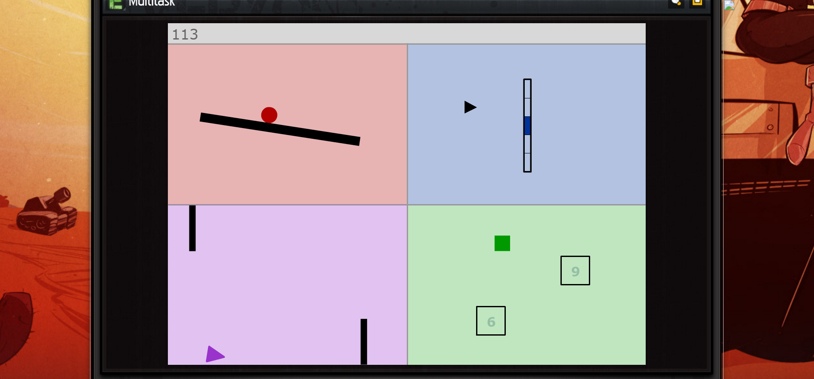
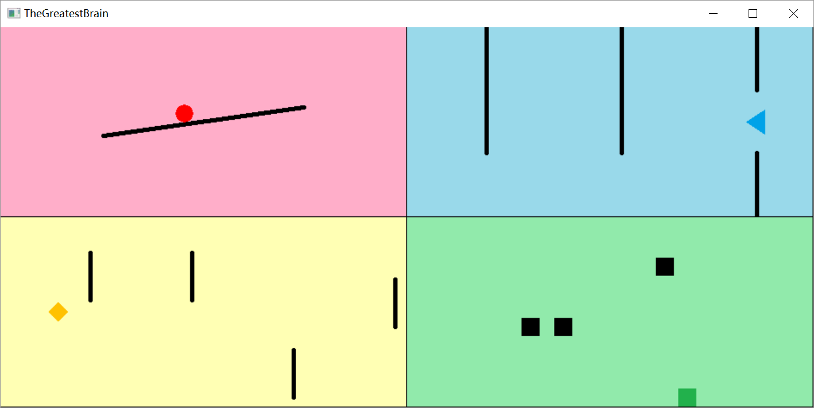
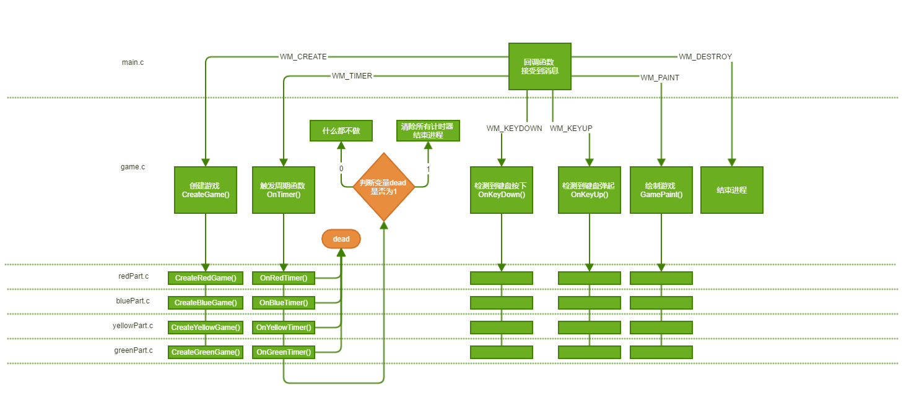

# 《程序设计实践实验报告》
# 目录
1. 选题  
1. 方案  
1. 关键技术  
1. 结果和效果  
1. 总结和不足  

# 选题
这是一个**多重任务**型的小游戏。游戏由四个部分组成，每个任务独立来看非常简单，但玩家需要同时控制这四个部分坚持尽可能长的时间，这是游戏难点与玩点所在。  
这个创意来自于小时候玩的一个小游戏。[原版](http://www.newgrounds.com/portal/view/506546)截图如下：  
  
我的版本与原版类似。截图如下：
  
其中四个部分的游戏规则如下：  
- 红色部分：使用←、→键控制小球平衡，不要让它掉下去  
- 蓝色部分：使用↑、↓键控制小三角避开墙面向左前行。其中每一层墙面一定有且仅有一个供通行的缺口。  
- 黄色部分：使用空格键控制菱形在适当的时候进入无敌状态避开障碍物向右前进。障碍物本身会上下来回移动，触碰到上下边缘时反向。当按下空格时，障碍物会变成白色，此时触碰障碍物不会造成游戏结束。但持续按住空格会让菱形“升温”，当“过热”时菱形会变成灰色，同时失去无敌的能力  
- 绿色部分：使用WASD控制小矩形避开敌人。敌人会沿45°角匀速直线移动，触碰到边缘时速度反向。  

# 方案
**游戏数据方面**：  
- 红色部分：由于只需要记录平台的角度以及小球的偏移量，所以就用一些基础数据类型的变量来保存这些值及其变化量即可。每当`OnRedTimer()`时，对这些变量做相应的修改。
- 蓝色部分：
	- 由于小三角的横坐标是固定的，所以只用了一个变量来记录它的纵坐标的位置。又由于它的位置只有三种情况（上中下），所以这个变量的取值只有三种；
	- 至于墙面，墙面的状态是用一个布尔型的二维数组进行保存（0代表没有墙，1代表有墙）。而墙面的位置，由于墙面是一整面墙（看上去有好几段），所以不需要记录纵坐标；又由于墙面与墙面之间是等间距的，所以只需要记录“最右侧墙的横坐标”以及“间距”，即可算得每面墙的横坐标。
- 黄色部分：菱形的位置是固定的，动的是障碍物。和蓝色部分类似的逻辑， 只记录了左数第一个障碍物的横坐标。关于纵坐标，则用了一个一维数组来记录。
- 绿色部分：小矩形的位置由一个`POINT`变量记录。每个敌人的位置则由一个一维`POINT`数组记录。

**接口与流程方面**：
接口与流程设计如下：  

其中所有的`.c`文件都包含`game.h`头文件，而`game.h`中只定义了少数几个全局变量（如窗口句柄`hwnd`，游戏结束`dead`等等）。每个部分各自所需要的变量分别在各自的`.c`文件中定义，这样可以做到互不干扰。  
此外，`game.c`与`XXPart.c`中的函数基本上是整体与个体的关系。拿`GamePaint()`来举例。当`GamePaint()`被调用时，它会分别调用四个`XXGamePaint()`子函数。在这些子函数中分别对四个部分独立进行绘制。其他几个主要函数也都是类似的设计。  
当某个`OnXXTimer()`检测到游戏结束时，`OnXXTimer()`先把变量`dead`赋值为1，然后立刻`return`。在`OnTimer()`中，调用完`OnXXTimer()`后，会检查`dead`的值，如果为1，则游戏结束。  

# 关键技术
1. 检测按键是否被持续按下：  
windows自己的逻辑是：在键盘按下的瞬间，给一个键盘被按下的消息；在持续按住键盘一两秒后，再持续给出键盘被按下的消息。这样的逻辑在需要判断按键是否被持续按下的游戏里是很破坏用户体验的（比如此小游戏中的红色与黄色部分）。  
我的解决方法是：设置一个变量。当检测到按键被按下时，将此变量设置为`TRUE`；当检测到按键弹起时，将此变量设置为`FALSE`。然后根据此变量的值，判断该按键是否被持续按下。  
2. 墙面/障碍物的进出：
蓝色部分的墙面是会不断右移的。对于这个问题，其实并没有用到比较复杂的数据结构（比如队列）。墙面的状态由一个二维数组进行记录。每当检测到最右侧的墙即将离开屏幕时，我将左数第1到第N-1面墙的状态赋值给第2到第N面墙，然后随机生成第1面墙的状态，同时将墙的位置回退到合适的位置，这样看上去就好像墙面不停地在往右移动一般。
黄色部分的障碍物同理。

# 结果和效果
最终的成品如前面展示过的截图所示：  
  
四个部分的画面非常流畅，相关判定方面也非常准确没有延迟，多次测试也没有发现BUG，可以说是符合预期。  
（除画面之外，游戏运行过程中还带有紧张的BGM~）

# 总结和不足
这个小游戏算是到目前为止我做过的最大的项目了，开发过程中确实发现很多不足。比如由于事先缺乏合理的规划，写出来的代码虽然也能跑，但可读性极差。稍微出现逻辑问题，排查难度相当大。所需的数据与函数也全部放在一个`.c`里，冗余信息密集而有效信息稀疏。为此我还花了一个晚上把已经完成的部分用相对合理的规划重写了一遍，可以说是体会到了码代码之前做好合理规划的重要性了。