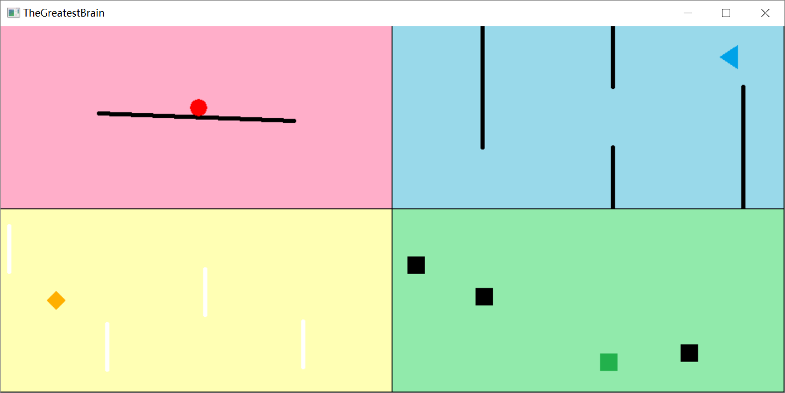

# 《最强大脑》

## 游戏说明：  
整个游戏由四个很简单的部分组成。玩家需要同时控制四个部分的游戏而不使其中任合一个失败。

### 红色部分（已完成）
平台上有一个小球，玩家需要使用←、→键控制平台，不让小球掉下去。

### 蓝色部分（已完成）
小三角面前有很多障碍，玩家需要使用↑、↓键控制小三角躲避障碍。

### 黄色部分（已完成）
小菱形前方有很多障碍，玩家需要使用空格键控制小菱形在适当的时机进入无敌状态。

### 绿色部分（已完成）
小正方形周围有很多敌人会四处游走，玩家需要使用WASD控制小正方形进行躲避。

# 用到的特殊数据结构
### 红色部分
无
### 蓝色部分
用布尔型的二维数组来表示每段墙是否存在（每一列墙有三段）。
### 黄色部分
用int型的数组来表示每个障碍（顶端）的纵坐标；  
用int型的数组来表示每个障碍当前的纵方向上的移动方向及速度。
### 绿色部分
用POINT的数组来表示每个敌人的当前位置；  
用POINT的数组来表示每个敌人的当前方向；